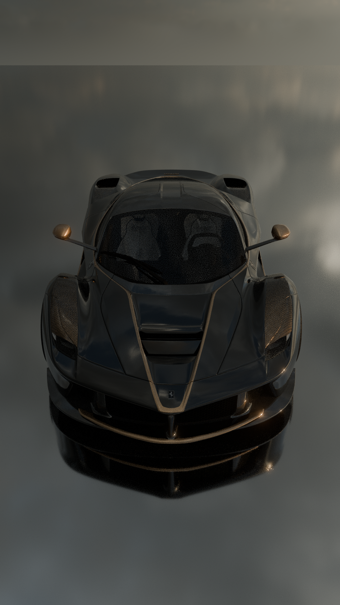
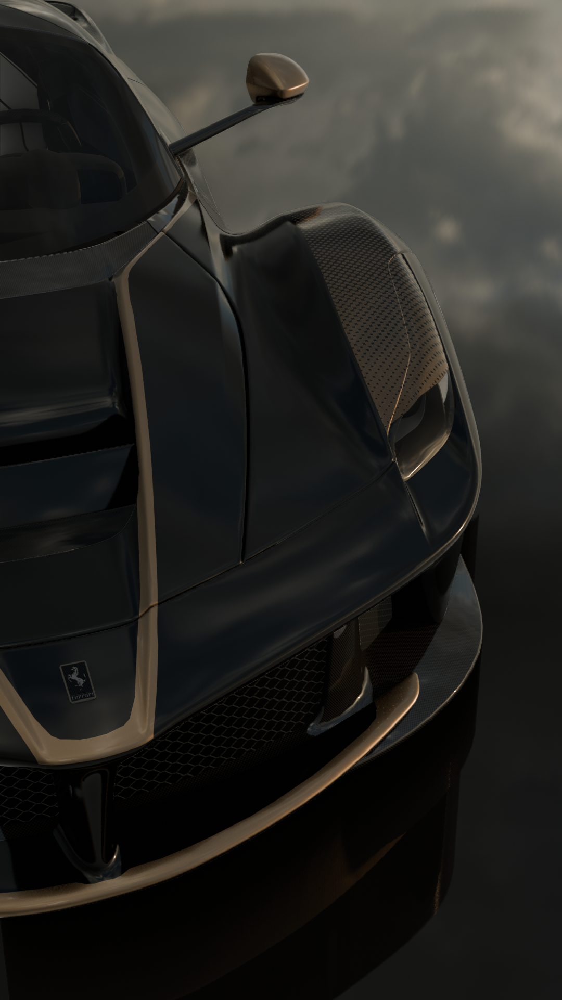
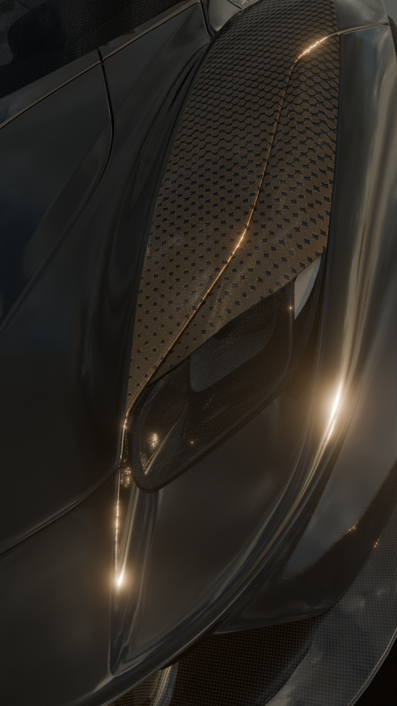
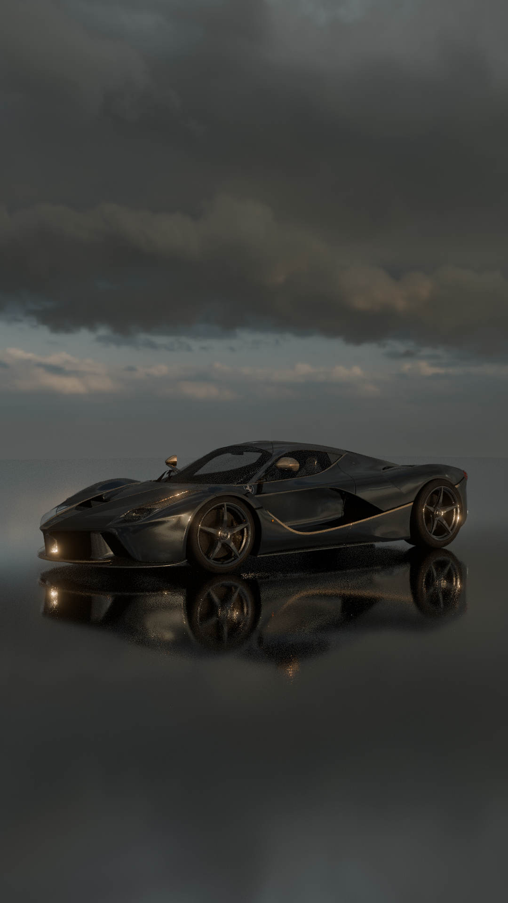

# LAFERRARI — 3D CINEMATIC

## Overview

A cinematic 3D LaFerrari animation created in Blender. I started with a LaFerrari model sourced from Sketchfab, then modified and refined it with my own materials, textures, camera animation, rendering, and video editing.

## 3D Work

* Modified and refined the original LaFerrari model.
* Created and applied my own materials and textures.
* Built the scenes and camera setups for the animation.
* Created smooth, stabilized camera movements.
* Individual shots were animated at around 100 frames.

## Rendering

The animation was initially tested in Cycles without denoising. I then switched to **Eevee** for the final rendering, which gave a great result while making the rendering process much more practical.

## Video Editing

The rendered clips were edited together into the final cinematic. Cuts and scene changes were timed to the beat of the music, keeping the edit focused on the car and avoiding unnecessary sections.

## Music

**Øfdream — Thelema (Slowed)**

[Listen on YouTube Music](https://music.youtube.com/watch?v=dbJcwzOb51s&si=8IQ7q3K1nru5l_HY)

## Final Video

**[Watch the Full Video](https://youtube.com/shorts/UCaVigC117I?si=yJ42UXRwK6nM4fag)**

## Renders & Media

<table>
  <tr>
    <td></td>
    <td></td>
  </tr>
</table>
<table>
  <tr>
    <td></td>
    <td></td>
  </tr>
</table>

## Source & Credits

The original **2014 Ferrari LaFerrari** 3D model was created by **Ddiaz Design (@ddiaz-design)** and sourced from Sketchfab.

[Original Sketchfab Model — 2014 Ferrari LaFerrari](https://sketchfab.com/3d-models/2014-ferrari-laferrari-8b46fa49718647de846387ef4c1e95b3)

The model was substantially modified and customized by me with my own materials, textures, scene setup, camera animation, rendering, and video editing.

## Project Info

* **Software:** Blender
* **Type:** 3D Animation / Cinematic
* **Work:** 3D Modification, Materials, Texturing, Camera Animation, Rendering, Video Editing
* **Status:** Completed
